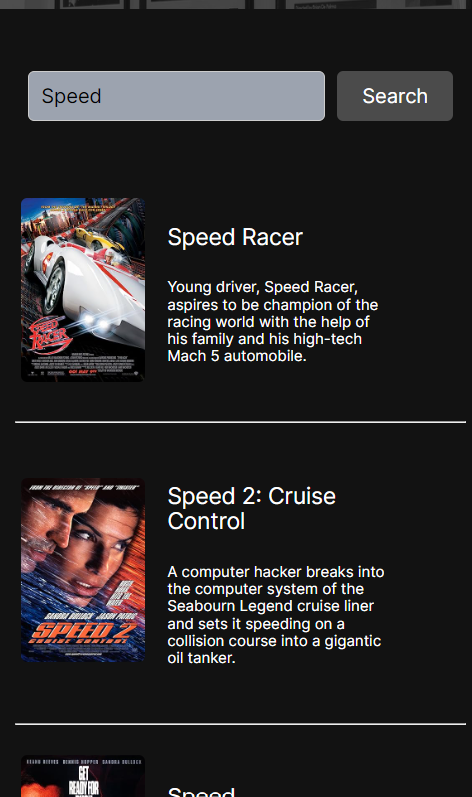

# Movie Search App

## Project Description

The Movie Search App is a web application built using JavaScript and the OMDB API. It allows users to search for movies by entering a movie title in the search input. The app fetches data from the OMDB API and displays information about the matching movies, including their titles, posters and descriptions. 

**Note to Users:** For an optimal user experience, it's recommended to view this app on a mobile screen.

## Live URL

You can explore the live version of the project [here](https://eshans-movie-app.netlify.app/).

## Screenshots

## Technologies Used

## How to Run It Locally

To run the Movie Search App on your local machine, follow these steps:

1. Clone this repository to your computer using Git: https://github.com/eshan-one/Movie-App-.git

2. Open the project directory: cd movie-search-app

3. Open the `index.html` file in your web browser.

4. Start searching for movies by entering their titles in the search input.

## License

This project is licensed under the MIT License. See the [LICENSE](LICENSE) file for details.

